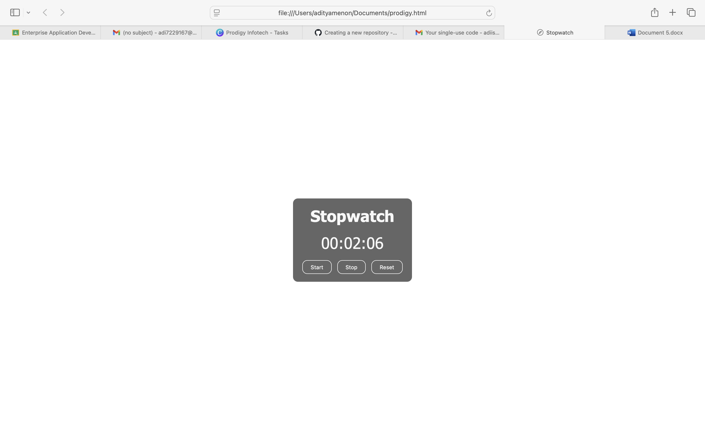

# PRODIGY_WD_02 - Stopwatch Web Application ⏱️

## 📌 Description  
This repository contains **Task 02** of my Prodigy Infotech Web Development Internship.  
The task was to create a stopwatch web application using **HTML, CSS, and JavaScript**.  

The stopwatch allows users to start, pause, reset, and record lap times, providing an accurate way to measure time intervals.  

### ✨ Features
- Start, Pause, and Reset functionality  
- Lap time recording and display  
- Clean and user-friendly interface  
- Responsive design for better viewing on different devices  

---

## 📸 Output Screenshot  

---

## 🛠️ Tech Stack
- **HTML5** – Structure  
- **CSS3** – Styling  
- **JavaScript (ES6)** – Stopwatch logic  

---

## 🌍 Live Demo  
👉 [View Stopwatch on GitHub Pages](https://aditya1027dev.github.io/PRODIGY_WD_02/)  

---

✅ This project demonstrates DOM manipulation, event handling, and timer functions in JavaScript.

